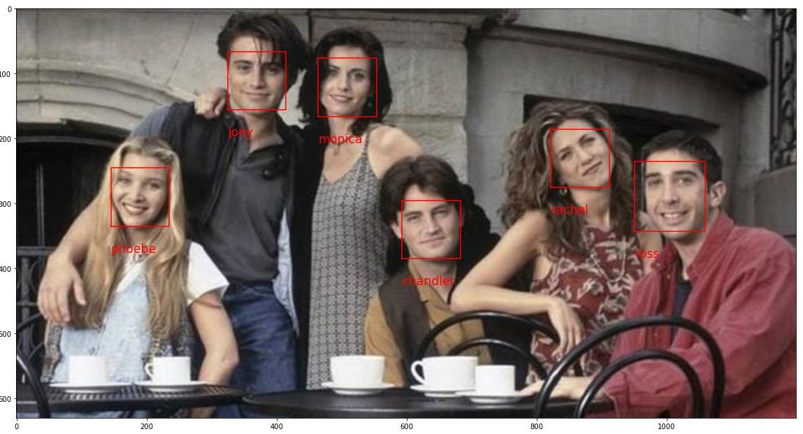

# Friends recognition

The purpose of this project is to identify people from the Friends TV show cast on an image.

## Create dataset

First of all we need to create a dataset with face features for each character in order to have enough data to train the model.

We have used [face-recognition](https://pypi.org/project/face-recognition/) library wich is able to detect faces from images and extract 128 different features from each face detected. It returns a list of faces detected with a list of features inside.

## Train model

Once we have our dataset created we have chosen RandomForest as model to predict faces on images.

With this model we've obtained excelent results...

&nbsp;
&nbsp;
&nbsp;
&nbsp;
&nbsp;

## Predict faces from a picture

Once the model has been trained we can make predictions and obtain labels for each face in the picture

